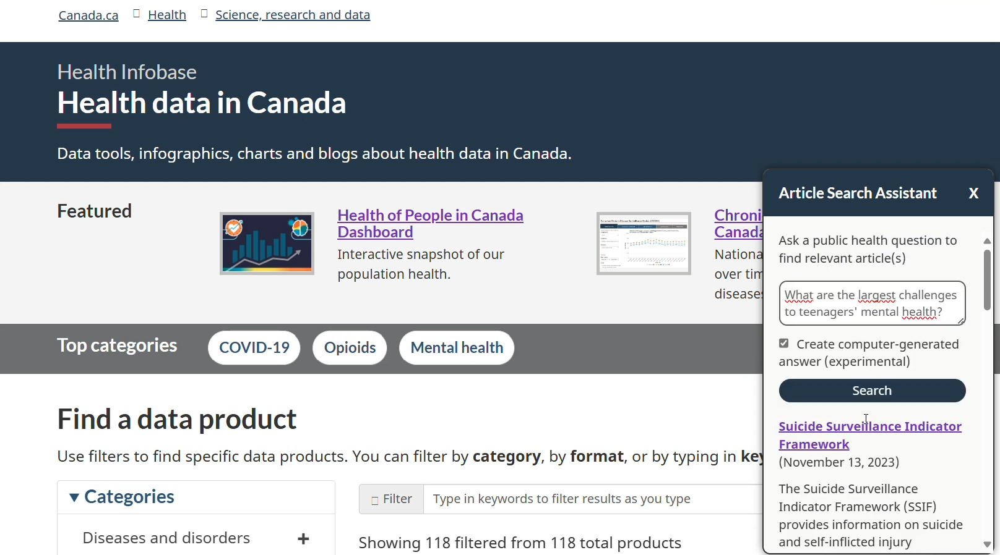

## Infobase Chatbot

An AI assistant to quickly be directed to articles and answer public health questions on the [Public Health Infobase site](https://health-infobase.canada.ca). The assistant is powered by [Langchain (notes)](https://docs.google.com/document/d/1D9kfjytOPmmVor2TjIY-LiUrCvEWILbXci5rqbgR84w/edit).



### Directories
- `./` contains the python files for a streamlit demo frontend, a Flask API backend, a script to create the vectorstore, and a script to initialise the models.
- `./demo-widget/` contains an example frontend for the application.
- `./logs/` contains logs from various tests of the chatbot.
- `./processed/` contains the vectorstores created. 
- `./unprocessed/` contains json files with the raw text data from the Infobase website.
- `./docker/` contains useful files to deploy the chatbot on AWS Lightsail

### Installation
Download this repository by running `git clone https://github.com/phac-aspc/infobase-chatbot.git` and then enter the directory with `cd infobase-chatbot`.

**You must have Python 3.11+ installed.** Dependancies are sensitive since Langchain is used, whose API is very rapidly changing at the time of development. You may wish to use virtual environments like `venv` or tools like `pyenv`. 

To install the required packages, run `pip install -r requirements.txt`.

Finally, **get API keys for [OpenAI](https://platform.openai.com), [Anthropic](https://console.anthropic.com), and [VoyageAI](https://voyageai.com)**. Place them in a `.env` file in the root directory:
```.env
OPENAI_API_KEY=[InsertYourKey]
ANTHROPIC_API_KEY=[InsertYourKey]
VOYAGE_API_KEY=[InsertYourKey]
```

### Quick Testing
Ensure you are in the root directory of the repository.

To quickly test the chatbot, you can run `python3 backend.py --help` to see chatbot answers via a Python script. 

You can also run the streamlit frontend with `streamlit run frontend.py` and interact with the chatbot in a web browser (recommended way of testing).

### Deployment
To deploy the chatbot to AWS lightsail, we have to build a docker image and push it to a container registry. **Don't attempt this if you're not familiar with Docker**. 

Here's an [AWS tutorial for the deployment process](://aws.amazon.com/en/tutorials/serve-a-flask-app/). It has quite a few setup steps needed to get the aws-cli and account permissions working. Note that you should use the dockerfile in the `./docker/` directory by copying it to the root directory: `cp ./docker/Dockerfile ./`.

P.S. I've configured the dockerfile and the AWS Lightsail environment to use **port 5555 instead of 5000**. Pay attention and don't just copy over commands; you'll mess something up and get lots of AWS bills!

### Updates
Here's a log of commands I used when updating my Lightsail service named `infobase-chatbot-flask-service-test` from my Docker image named `flask_api`. 
1. `cp ./docker/* ./` to get all the dockerfiles and lightsail configuration files in the root directory.
2. `docker build -t flask_api ./` to build the docker image.
3. Delete the old container I had.
4. `docker run -p 5555:5555 --name c_flask_api flask_api` to test the docker image locally.
5. `aws lightsail get-container-services` to remind myself of the old lightsail service name. 
6. `aws lightsail push-container-image --service-name infobase-chatbot-flask-service-test --label c-flask-api --image flask_api` to push the new image to the lightsail service.
7. Update my `lightsail-container.json` with the new version number of the image.
8. `aws lightsail create-container-service-deployment --service-name infobase-chatbot-flask-service-test --containers file://lightsail-container.json --public-endpoint file://lightsail-endpoint.json` to deploy the new image to the lightsail service.
9. `aws lightsail get-container-services --service-name infobase-chatbot-flask-service-test` to check the status of the deployment.
10. `rm Dockerfile lightsail*` to get rid of the files I copied over.
